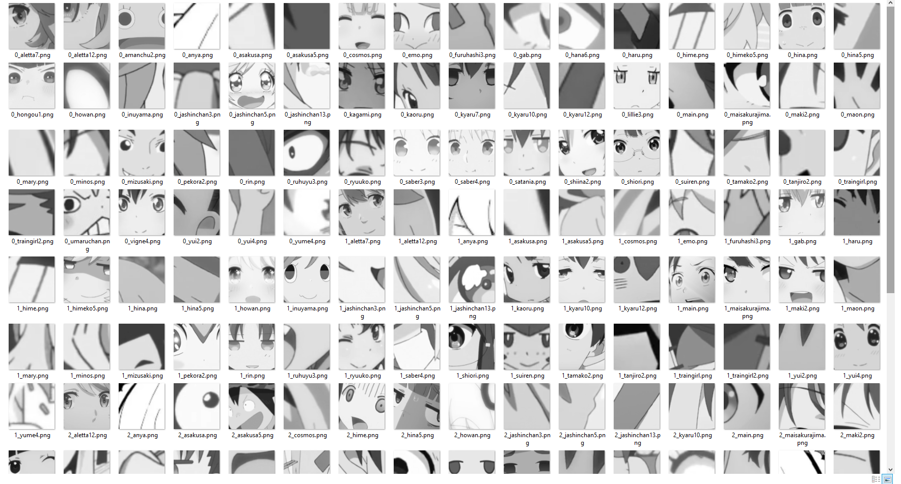

# anime face classifier*    
    
I have a bunch of anime character screenshots that make excellent reaction faces but they're unorganized and I'd rather not sort them manually (I want to have them sorted by emotion).    
I haven't found a solution yet to my problem but I think it provides a good opportunity to explore computer vision topics! :D    
    
One significant issue is extracting anime faces from images, which is necessary for making predictions from input images (and creating my dataset).    
The Haar classifiers that OpenCV provides don't yield very good results. I found one created by nagadomi (see acknowledgements) but haven't had much success with it either (see results below).    
    
my dataset I'd like to extract faces from:    
    
    
extracted faces using the cascade classifier by nagadomi:    
    
    
extracted faces after trying out my first classifier. I had a positive sample vector of 98 images to train on. It looks like for a lot of my faces they did get detected (eventually) but a lot of them had multiple features detected as well besides the desired result so I looped through and outputted all of them.    
    
	
## Acknowledgements:    
https://github.com/nagadomi/lbpcascade_animeface for providing an anime face cascade classifier.    
http://www.paulvangent.com/2016/04/01/emotion-recognition-with-python-opencv-and-a-face-dataset/ for providing a wonderful tutorial.    
    
If you're interested in Paul's tutorial, I recommend the dataset provided here: https://zenodo.org/record/3451524#.XpH8LchKiUk.    
	
    
*an attempt at making one, at least    