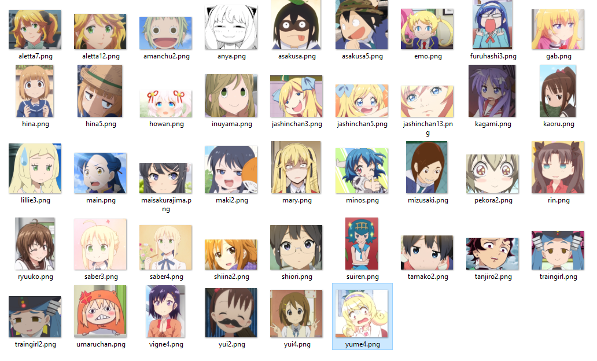
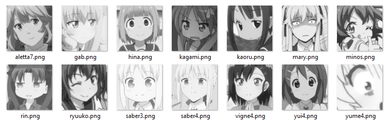
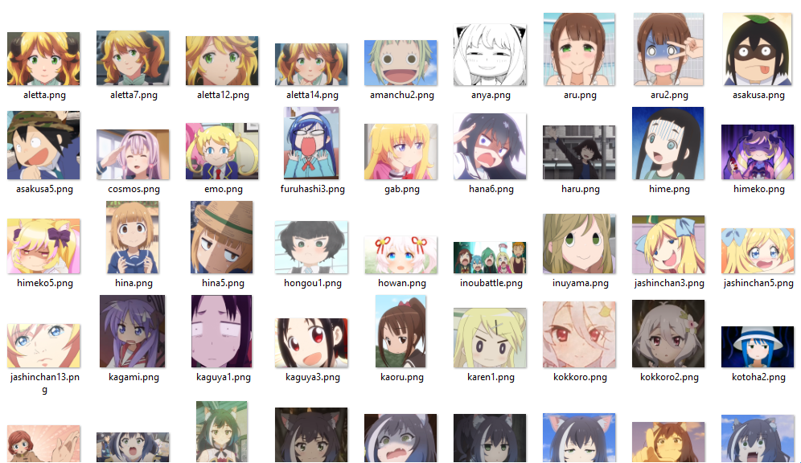
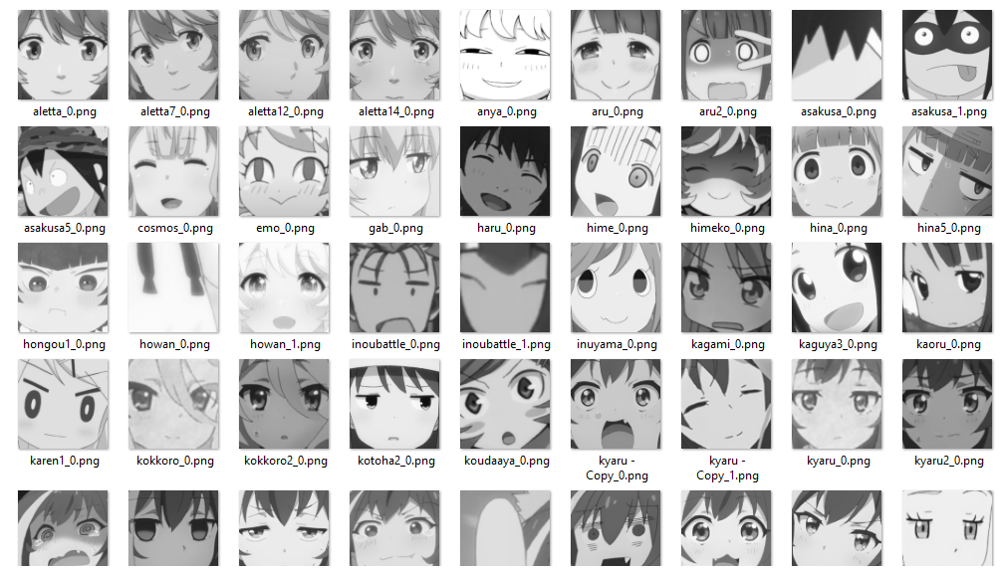

# anime face classifier    
    
I have a bunch of anime character screenshots that make excellent reaction faces but they're unorganized and I'd rather not sort them manually (I want to have them sorted by emotion).       
    
One significant issue is extracting anime faces from images, which is necessary for making predictions from input images (and creating my dataset).    
The Haar classifiers that OpenCV provides don't yield very good results. I found one created by nagadomi (see acknowledgements) but haven't had much success with it either (see results below).    
    
my dataset that I'd like to extract faces from looks something like this:    
    
    
extracted faces using the cascade classifier by nagadomi:    
    
    
So I made my own classifier instead with 210 positive samples (you can see the samples in positive_training_samples.vec) and 633 negative samples. The classifier and its stage files are in the cascade_classifier directory. At least for me, I think my classifier turned out to be satisfactory (it was able to extract a fair number of faces from the images I fed it). It's never going to be perfect and I definitely expect to sort out some false positives.
	
here's my dataset again (there's nothing inappropriate in any of my datasets btw, just to be super transparent):    
    
    
here's the extracted faces using my classifier:    
    
    
Then, from those faces that were able to be extracted, I sorted them into emotions like happy, sad, neutral, angry, etc. Although the number of images for some emotions were quite small, after training the recognizer for 20 cycles, I got some surprisingly decent results when testing on the images in test_data/. Some of those images were the ones trained on, which I suppose should not be surprising that they got sorted properly but there were some new images that got sorted correctly. So I think this is a decent start to accomplishing my goal. The next best thing to do would probably be to get more data to train an even more accurate recognizer! :)       
    
## Acknowledgements:    
https://github.com/nagadomi/lbpcascade_animeface for providing an anime face cascade classifier to try out.    
    
Thanks to Paul van Gent for providing an awesome tutorial on emotion recognition with Python.    
    
van Gent, P. (2016). Emotion Recognition With Python, OpenCV and a Face Dataset. A tech blog about fun things with Python and embedded electronics. Retrieved from:
http://www.paulvangent.com/2016/04/01/emotion-recognition-with-python-opencv-and-a-face-dataset/
    
If you're interested in following Paul's tutorial, I can recommend the dataset provided here: https://zenodo.org/record/3451524#.XpH8LchKiUk.    
	
And of course the various anime I got images in anime_faces/ from (I haven't actually watched all of these - just saw some clips for some):   
- ひとりぼっちの○○生活
- ポケットモンスター サン＆ムーン
- らき☆すた
- かくしごと
- SHOW BY ROCK!!ましゅまいれっしゅ!!
- プリンセスコネクト！ Re:Dive
- キラッとプリ☆チャン
- ミュークルドリーミー
- 邪神ちゃんドロップキック'
- 異世界食堂
- ガヴリールドロップアウト
- たまこまーけっと
- かぐや様は告らせたい ～天才たちの恋愛頭脳戦～
- 映像研には手を出すな！
- 放課後ていぼう日誌
- 私に天使が舞い降りた!
- あまんちゅ！
- 文豪ストレイドッグス 第25話 『独り歩む』
- 恋愛ラボ
- 異能バトルは日常系のなかで
- ぼくたちは勉強ができない！
- きんいろモザイク
- 『ガールズ＆パンツァー 最終章』第2話
- 青春ブタ野郎
- 賭ケグルイ
- 衛宮さんちの今日のごはん
- へやキャン△
- グレイプニル
- けいおん!
- たまゆら～hitotose～
- イエスタデイをうたっ
- 電波女と青春男
- 干物妹! うまるちゃん
- 幸腹グラフィティ
- 本好きの下剋上 ～司書になるためには手段を選んでいられません～
- 俺を好きなのはお前だけかよ
- 鬼滅の刃
- 三ツ星カラーズ
    
I think that's all of them. sorry if I forgot any!    

